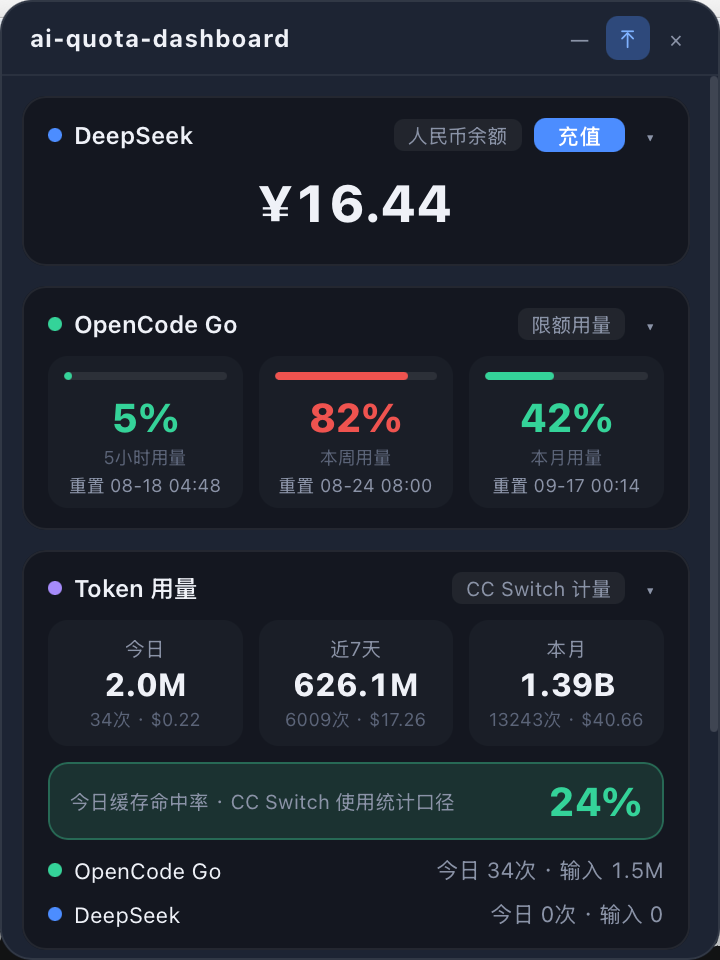

# ai-quota-dashboard

桌面悬浮折叠 AI 额度看板 (Tauri). 实时查看 DeepSeek 余额、OpenCode Go 限额、Token 用量/费用/缓存命中率与趋势, 30s 自动刷新, 点击一键充值。

参考小红书「AI 详情」看板设计 (深色主题)。

<p align="center">
  
</p>

> A floating, collapsible desktop AI-quota dashboard built with Tauri — live DeepSeek balance, OpenCode Go quota, and CC Switch token usage/cache-hit/trend, auto-refresh every 30s. Credentials are read at runtime from `~/.env` / `auth.json`, never committed.

## 功能

- 🪟 桌面悬浮透明无边框窗口, 可拖动, 可吸顶 (always-on-top), 可折叠成一条
- 💰 **DeepSeek 余额** — 实时拉取 `api.deepseek.com/user/balance` (¥ 显示)
- 📊 **OpenCode Go 限额** — 5h / 本周 / 本月 剩余百分比 + 重置时间
- 🔢 **Token 用量** — 今日 / 近7天 / 本月 请求数 + token + 费用 (来自 CC Switch 本地数据)
- ⚡ 缓存命中率
- 📈 近7天 token 用量趋势折线图 (canvas)
- ⏱ 30s 自动刷新, 数据源失败独立降级 (不崩整体)
- ➕ 点击「充值」系统浏览器打开对应充值页

## 数据源

| 指标 | 来源 |
|---|---|
| DeepSeek 余额 | `GET https://api.deepseek.com/user/balance` |
| OpenCode Go 限额 | `GET https://opencode.ai/zen/go/v1/usage` |
| Token 用量/费用/趋势 | `~/.cc-switch/cc-switch.db` (`proxy_request_logs`) |

## 密钥配置 (不写进代码)

- **DeepSeek**: `~/.env` 里的 `DEEPSEEK_API_KEY`
- **OpenCode**: `~/.local/share/opencode/auth.json` (`{ provider: { "key": "sk-..." } }`)

## 开发

```sh
source ~/.cargo/env   # Rust 工具链
npm install
npm run tauri dev     # 开发 (HMR)
npm run tauri build   # 打包 .app
```

## 技术栈

- **Tauri 2** (Rust + WebView), macos-private-api (透明窗口)
- 前端: 原生 TS + Vite, 无框架, canvas 手写折线图
- Rust: reqwest (rustls) / rusqlite (bundled) / tauri-plugin-opener

## 窗口控制

- 无边框透明, always-on-top, skip-taskbar
- 折叠: `toggle_collapse` (360×480 ↔ 360×44)
- 吸顶: `toggle_pin`, 拖动: `window.startDragging` (titlebar `data-tauri-drag-region`)
